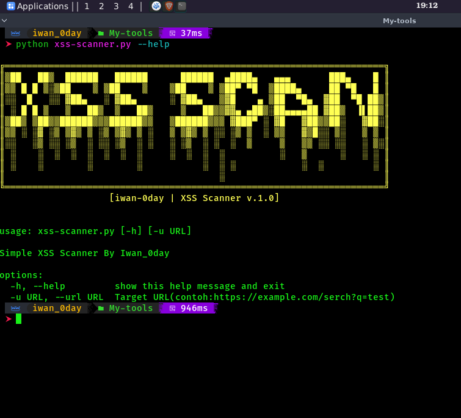

# 🛡️ XSS-Scanner-DualMode (v1.0)
**Simple & Powerful XSS Vulnerability Scanner with Dual-Mode Detection.**
Developed by **Iwan_0day** for educational purposes and security research.

<p align="center">
  
</p>

---

## 🚀 Overview
XSS-Scanner-DualMode adalah tools sederhana berbasis Python untuk mendeteksi celah **Cross-Site Scripting (XSS)**. Tools ini dirancang khusus untuk membantu pentester pemula (seperti saya) dalam memahami bagaimana payload direfleksikan melalui metode **GET** maupun **POST**.

## ✨ Key Features
* **Dual-Detection**: Mengetes parameter melalui URL (GET) dan Body (POST) secara bersamaan.
* **Smart Fuzzing**: Mendukung pengetesan multi-parameter (seperti `searchFor`, `test`, dll).
* **Auto-Encoding**: Menggunakan URL encoding agar link hasil scan di metode GET bisa langsung di-klik dan di-test di browser.
* **High Visibility**: Output terminal berwarna (Ijo = Vuln, Merah = Safe) menggunakan library `Colorama`.
* **Custom Payloads**: Terisi dengan payload XSS pilihan untuk bypass filter standar.

## 🛠️ Installation & Usage
Pastikan Anda sudah menginstal Python di sistem Anda (Kali Linux, Parrot OS, atau Windows).

```bash
# Clone the repository
git clone [https://github.com/Siiwannn/xss-scanner](https://github.com/Siiwannn/xss-scanner.git)
cd XSS-Scanner-Iwan0day

# Install dependencies
pip install -r requirements.txt

# Run the scanner
python xss-scanner.py -u "[http://target-web.com/search.php](http://target-web.com/search.php)"
